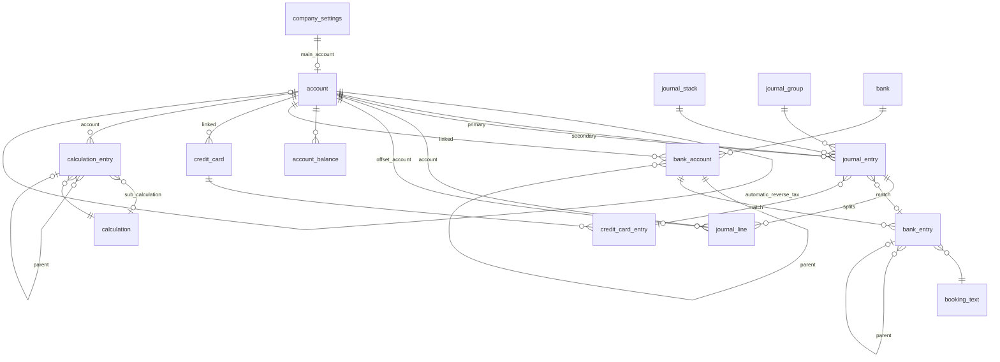

# Ziel-Datenbankschema für D2V-Neubau in dblicious

## Context

D2V2019 (UWP + EF Core 2.2 + SQLite) wird nicht weiterentwickelt. Der Neubau erfolgt als dblicious-Anwendung (Rust + Leptos + SeaORM). Dieses Dokument ist das **Soll-Schema** als Zielbild — die Datenbank-Form, gegen die der Neubau entwickelt wird.

Verhältnis zu bereits existierenden dblicious-Specs:

- **Track A** (`docs/superpowers/specs/2026-05-19-d2v-data-port-design.md` im dblicious-Repo) macht die bestehende `d2v.db` **als-ist** im dblicious-CRUD-UI sichtbar — keine Schema-Änderung. Das ist der erste praktische Schritt, nicht das hier definierte Ziel.
- **Track B** (`docs/superpowers/specs/2026-05-19-dblicious-source-architecture-design.md` im dblicious-Repo) liefert die `Source`-Trait, die Track A überhaupt erst möglich macht — Vorbedingung, nicht Teil dieses Ziels.
- **Dieses Dokument** definiert die Ziel-Form: das Schema, das nach der vollständigen Migration auf dblicious-Konventionen entstehen soll. Es ist die Form, die der dblicious-Designer (`saveDbSchema` → `ddl::try_apply_schema`) konstruieren würde, wenn man D2V von Grund auf in dblicious neu modelliert. Realisierung erfolgt schrittweise nach Track C (Domain-Funktionalität pro Feature), nicht in einem Big-Bang.

Annahmen:

- **Single-Tenant**: eine Firma pro Datenbank. Keine `tenant_id`-Spalte (dblicious kennt das Feld nur in `permissions`, nicht in Domain-Tabellen).
- **Engine-agnostisch via dblicious-Source-Trait**: das Schema ist in `shared::DbColumnType`-Begriffen formuliert. dblicious bildet das auf SQLite/Postgres/MySQL/MSSQL ab; wo eine Engine ein Feature nicht hat, kompensiert die `Source`-Implementierung.
- **managed-sqlite ist Default-Engine**: für die D2V-App heißt das eine eigenständige `d2v.db` (Owner: dblicious). Schema-Evolution läuft über dblicious-Migrations (Phase 3 Roadmap, zweiphasig: Expansion → Cutover → Contract).
- **Audit, Concurrency, Created/Updated übernimmt dblicious automatisch** via `AuditRole`-Spalten und `concurrency_token: true`. Spalten mit Audit-Rolle werden vom Server bei jeder Mutation selbst gesetzt, der Client sendet sie nicht.

---

## Grundsätzliche Verbesserungen gegenüber dem Alt-Schema

1. **Surrogate-PKs überall** (`id: BigInt, generated: OnAdd, primary_key: true`). Domänen-Schlüssel (`Number`, `Code`, `(AccountNr, Year)`) werden zu UNIQUE-Indexes via `DbIndex.unique = true`. Konto-Umnummerierung bricht keine FK-Kette mehr.
2. **Audit ist dblicious-nativ** über `AuditRole::CreatedAt/UpdatedAt/CreatedBy/UpdatedBy`-Spalten. Die alte verkettete `DatevEntryChangeTracking`-Liste entfällt; vollständige History pro Mutation wandert in das generische dblicious-`audit_log` (Phase 0.7.6 der Roadmap). Pro Tabelle keine zusätzliche History-Tabelle nötig.
3. **Concurrency-Token** über `concurrency_token: true` (von dblicious als `OnAddOrUpdate` versioniert). Optimistic-Lock-Verstöße werfen `DbUpdateConcurrencyException` aus der dblicious-Mutation-Schicht.
4. **JSON-Spalten** für die 14 `Description1`–`Description14` von `StarMoneyEntry` (heute flach) → eine `descriptions: Json`-Spalte. dblicious unterstützt `DbColumnType::Json` nativ.
5. **Konfigurierbare Spezialkonten** in `bookkeeping_config`-Tabelle statt hartcodiert in `DatevAccounts.cs`/`KnownKeys.cs`. Seed beim ersten Boot.
6. **Soft-Delete** via Spalte `deleted_at: DateTime nullable` (dblicious kennt keinen nativen Soft-Delete-Mechanismus; wird per Konvention in der Source-Schicht durch Default-Filter `WHERE deleted_at IS NULL` umgesetzt).
7. **Composite-PKs entfallen vollständig** — alle Composite-Cases (`StarMoneyAccount(BankCode, Code)`, `DatevAccountEntry(EntryId, AccountNr, OffsetAccountNr)`, `DatevCalculationValue(CalculationId, Year, Method)`, `SuSaEntry(AccountNr, Year)`) bekommen Surrogate-PK + UNIQUE-Index.
8. **`IsDiscountRelated` ist Teil der Eindeutigkeit** von `journal_line` → behebt den latenten Konflikt aus `DatevEntry.GenerateAccountEntries`.
9. **`DatevCalculationValue` als persistenter Cache entfällt** — Werte werden zur Laufzeit aus `account_balance` + `calculation_entry` berechnet. dblicious-Server cached pro Session.
10. **Orphan-Klassen** (`DatevToStarMoneySearch*`, `DatevInvertPairSearchResult`, `StarMoneyCompareToDatev`) bleiben Rust-Runtime-Strukturen, sind kein Schema.
11. **`Company` als FK-Anker entfällt** → `company_settings`-Singleton-Tabelle (eine Zeile mit Firmenstamm­daten).
12. **`AccountType`-Bitflags** bleiben als `Integer`-Spalte; dblicious-`FieldType::Integer` deckt das ab. Die Bit-Semantik wird im Rust-Domain-Layer per `bitflags!` ausgewertet.

---

## ER-Diagramm



`bookkeeping_config` und `audit_log` (dblicious-system-managed) sind nicht im ERD enthalten, da polymorph/Singleton.

---

## Tabellen-Definitionen (dblicious-`DbSchema`-Vokabular)

Notation pro Tabelle:

- **Spalte** | **DbColumnType** | **Flags** | **AuditRole** | **Bemerkung**
- "Flags": `pk` = primary key, `null` = nullable, `uniq` = unique, `ct` = concurrency_token, `gen=OnAdd|OnAddOrUpdate` = ColumnGenerated.
- FKs werden separat unter "Relations" gelistet (entspricht `DbRelation`).
- Indexes separat (entspricht `DbIndex`).

### `company_settings` — Singleton-Stammdaten der Firma

| Spalte | Typ | Flags | Audit | Bemerkung |
|---|---|---|---|---|
| `id` | BigInt | pk, gen=OnAdd | – | erzwungen `= 1` per CHECK |
| `name` | Text | – | – | |
| `tax_id` | Text | null | – | Steuernummer |
| `vat_id` | Text | null | – | USt-IdNr. |
| `address` | Text | null | – | |
| `main_account_id` | ForeignKey (BigInt) | null | – | → `account.id` ON DELETE SetNull |
| `row_version` | BigInt | ct, gen=OnAddOrUpdate | – | |
| `created_at` | DateTime | gen=OnAdd | CreatedAt | |
| `updated_at` | DateTime | gen=OnAddOrUpdate | UpdatedAt | |
| `deleted_at` | DateTime | null | – | Soft-Delete |

### `account` — DATEV-Kontenrahmen (war: `DatevAccount`, PK war `Number`)

| Spalte | Typ | Flags | Audit | Bemerkung |
|---|---|---|---|---|
| `id` | BigInt | pk, gen=OnAdd | – | |
| `number` | Integer | uniq | – | 1–99999, CHECK; war PK |
| `name` | Text | – | – | |
| `english_name` | Text | null | – | |
| `account_type` | Integer | – | – | Bitflags BS/Profit/Loss/Debitor/Creditor/VatPossible/Automatic/Special/NoEbCheck |
| `tax_rate` | Decimal(8,4) | null | – | nur wenn Automatic |
| `automatic_tax_account_id` | ForeignKey | null | – | → `account.id` ON DELETE Restrict |
| `automatic_reverse_tax_account_id` | ForeignKey | null | – | → `account.id` ON DELETE Restrict |
| `row_version` | BigInt | ct, gen=OnAddOrUpdate | – | |
| `created_at` | DateTime | gen=OnAdd | CreatedAt | |
| `updated_at` | DateTime | gen=OnAddOrUpdate | UpdatedAt | |
| `deleted_at` | DateTime | null | – | |

**Indexes**: `IX_account_account_type` on `(account_type)`.

### `journal_stack` — Buchungs-Batch (war: `DatevEntryStack`)

| Spalte | Typ | Flags | Audit | Bemerkung |
|---|---|---|---|---|
| `id` | BigInt | pk, gen=OnAdd | – | |
| `name` | Text | – | – | |
| `file_name` | Text | null | – | Quell-Importdatei |
| `year` | Integer | – | – | |
| `month` | Integer | – | – | CHECK 1–12 |
| `row_version`, `created_at`, `updated_at`, `deleted_at` | … Standard … | | | |

**Indexes**: `IX_journal_stack_year_month` on `(year, month)`.

### `journal_group` — Buchungsgruppe (war: `DatevEntryGroup` — Stub)

| Spalte | Typ | Flags | Audit |
|---|---|---|---|
| `id` | BigInt | pk, gen=OnAdd | – |
| `label` | Text | null | – |
| `row_version`, `created_at`, `updated_at`, `deleted_at` | … Standard … | | |

**Anmerkung**: Im Alt-System bestand die Entity nur aus `Id`. `label` ist neu — falls T9b (Track-C-Backlog) ergibt, dass `DatevEntryGroup` ohne Inhalt überflüssig ist, kann die Tabelle entfallen.

### `journal_entry` — Buchungssatz (war: `DatevEntry`)

| Spalte | Typ | Flags | Audit | Bemerkung |
|---|---|---|---|---|
| `id` | BigInt | pk, gen=OnAdd | – | |
| `external_id` | Integer | null | – | Belegnummer aus Quelle |
| `document_info` | Text | null | – | |
| `description` | Text | null | – | |
| `booking_date` | Date | – | – | |
| `value` | Decimal(18,4) | – | – | CHECK > 0 |
| `value_type` | Integer | – | – | 0=SOLL, 1=HABEN (Enum) |
| `key` | Text | null | – | Buchungsschlüssel |
| `is_inverted` | Boolean | – | – | DEFAULT false |
| `discount` | Decimal(18,4) | null | – | |
| `is_published` | Boolean | – | – | DEFAULT false |
| `primary_account_id` | ForeignKey | – | – | → `account.id` ON DELETE Restrict |
| `secondary_account_id` | ForeignKey | – | – | → `account.id` ON DELETE Restrict |
| `stack_id` | ForeignKey | – | – | → `journal_stack.id` ON DELETE Restrict |
| `group_id` | ForeignKey | null | – | → `journal_group.id` ON DELETE SetNull |
| `bank_entry_id` | ForeignKey | null | – | → `bank_entry.id` ON DELETE SetNull |
| `credit_card_entry_id` | ForeignKey | null | – | → `credit_card_entry.id` ON DELETE SetNull |
| `row_version`, `created_at`, `updated_at`, `deleted_at`, `created_by`, `updated_by` | … Standard + User-Audit … | | | |

**Indexes**:
- `IX_journal_entry_booking_date` on `(booking_date)`
- `IX_journal_entry_published_date` on `(is_published, booking_date)`
- `IX_journal_entry_stack` on `(stack_id)`
- `IX_journal_entry_primary_account` on `(primary_account_id)`
- `IX_journal_entry_secondary_account` on `(secondary_account_id)`

**Invariante**: Summe `journal_line.debit_value - credit_value` über alle Lines == 0 pro Entry. Wird im dblicious-Domain-Service vor Save geprüft (kein DB-CHECK).

### `journal_line` — Konto-Split (war: `DatevAccountEntry`, Bugfix: IsDiscount in Unique)

| Spalte | Typ | Flags | Audit | Bemerkung |
|---|---|---|---|---|
| `id` | BigInt | pk, gen=OnAdd | – | neu — alte PK war composite |
| `journal_entry_id` | ForeignKey | – | – | → `journal_entry.id` ON DELETE **Cascade** |
| `account_id` | ForeignKey | – | – | → `account.id` ON DELETE Restrict |
| `offset_account_id` | ForeignKey | – | – | → `account.id` ON DELETE Restrict |
| `is_discount_related` | Boolean | – | – | DEFAULT false |
| `factor` | Decimal(18,8) | – | – | |
| `debit_value` | Decimal(18,4) | null | – | |
| `credit_value` | Decimal(18,4) | null | – | |
| `row_version`, `created_at`, `updated_at`, `deleted_at` | … Standard … | | | |

**Indexes**:
- `UX_journal_line_split` UNIQUE on `(journal_entry_id, account_id, offset_account_id, is_discount_related)` ← **das ist der Bugfix gegenüber dem Alt-Schema**
- `IX_journal_line_account` on `(account_id)`
- `IX_journal_line_offset_account` on `(offset_account_id)`

### `account_balance` — SuSa (war: `SuSaEntry`, PK war `(AccountNr, Year)`)

| Spalte | Typ | Flags | Audit |
|---|---|---|---|
| `id` | BigInt | pk, gen=OnAdd | – |
| `account_id` | ForeignKey | – | – |
| `year` | Integer | – | – |
| `eb_debit` | Decimal(18,4) | – | – |
| `eb_credit` | Decimal(18,4) | – | – |
| `debit_value` | Decimal(18,4) | – | – |
| `credit_value` | Decimal(18,4) | – | – |
| `row_version`, `created_at`, `updated_at`, `deleted_at` | … Standard … | | |

FK: `account_id` → `account.id` ON DELETE Cascade.
**Indexes**: `UX_account_balance_account_year` UNIQUE on `(account_id, year)`.

### `bank` — Banken (war: `StarMoneyBank`, PK war `Code`)

| Spalte | Typ | Flags | Audit |
|---|---|---|---|
| `id` | BigInt | pk, gen=OnAdd | – |
| `bic` | Text | uniq | – |
| `name` | Text | – | – |
| `address` | Text | null | – |
| `row_version`, `created_at`, `updated_at`, `deleted_at` | … Standard … | | |

### `bank_account` — Bankkonto (war: `StarMoneyAccount`, PK war `(BankCode, Code)`)

| Spalte | Typ | Flags | Audit |
|---|---|---|---|
| `id` | BigInt | pk, gen=OnAdd | – |
| `bank_id` | ForeignKey | – | – |
| `code` | Text | – | – | IBAN / Konto-Code |
| `parent_id` | ForeignKey | null | – |
| `linked_account_id` | ForeignKey | null | – | → `account.id` |
| `name` | Text | null | – |
| `row_version`, `created_at`, `updated_at`, `deleted_at` | … Standard … | | |

FKs:
- `bank_id` → `bank.id` ON DELETE Restrict
- `parent_id` → `bank_account.id` ON DELETE Restrict
- `linked_account_id` → `account.id` ON DELETE SetNull

**Indexes**:
- `UX_bank_account_bank_code` UNIQUE on `(bank_id, code)`
- `IX_bank_account_parent` on `(parent_id)`
- `IX_bank_account_linked` on `(linked_account_id)`

### `booking_text` — Buchungstext-Katalog (war: `StarMoneyBookingText`, PK war `Key`)

| Spalte | Typ | Flags | Audit |
|---|---|---|---|
| `id` | BigInt | pk, gen=OnAdd | – |
| `key` | Integer | uniq | – |
| `category` | Integer | – | – | Enum (82=EINZAHLUNG, 83=AUSZAHLUNG…) |
| `text` | Text | – | – |
| `aliases` | Json | null | – | War: Text2–Text8 |
| `row_version`, `created_at`, `updated_at`, `deleted_at` | … Standard … | | |

### `bank_entry` — Bank-Buchung (war: `StarMoneyEntry`, 40+ Spalten flach)

| Spalte | Typ | Flags | Audit | Bemerkung |
|---|---|---|---|---|
| `id` | BigInt | pk, gen=OnAdd | – | |
| `bank_account_id` | ForeignKey | – | – | → `bank_account.id` ON DELETE Cascade |
| `parent_id` | ForeignKey | null | – | → `bank_entry.id` ON DELETE SetNull (Split-Parent) |
| `booking_text_id` | ForeignKey | – | – | → `booking_text.id` ON DELETE Restrict |
| `booking_date` | Date | – | – | |
| `value_date` | Date | null | – | |
| `value` | Decimal(18,4) | – | – | |
| `category` | Text | null | – | |
| `tax_rate` | Decimal(8,4) | null | – | |
| `descriptions` | Json | – | – | War: Description1–Description14, jetzt Array von Strings |
| `split_value` | Decimal(18,4) | null | – | |
| `split_tax_rate` | Decimal(8,4) | null | – | |
| `origin_value` | Decimal(18,4) | null | – | FX |
| `origin_currency` | Text | null | – | FX |
| `foreign_fee` | Decimal(18,4) | null | – | FX |
| `row_version`, `created_at`, `updated_at`, `deleted_at` | … Standard … | | | |

**Indexes**:
- `IX_bank_entry_booking_date` on `(booking_date)`
- `IX_bank_entry_bank_account` on `(bank_account_id)`
- `IX_bank_entry_parent` on `(parent_id)`

### `credit_card` (war: `StarMoneyCreditCard`)

| Spalte | Typ | Flags | Audit |
|---|---|---|---|
| `id` | BigInt | pk, gen=OnAdd | – |
| `code` | Text | uniq | – |
| `linked_account_id` | ForeignKey | null | – | → `account.id` |
| `label` | Text | null | – |
| `row_version`, `created_at`, `updated_at`, `deleted_at` | … Standard … | | |

### `credit_card_entry` (war: `StarMoneyCreditCardEntry`)

| Spalte | Typ | Flags | Audit |
|---|---|---|---|
| `id` | BigInt | pk, gen=OnAdd | – |
| `credit_card_id` | ForeignKey | – | – | → `credit_card.id` ON DELETE Cascade |
| `booking_date` | Date | – | – |
| `value_date` | Date | null | – |
| `value` | Decimal(18,4) | – | – |
| `category` | Text | null | – |
| `exchange_rate` | Decimal(18,8) | null | – |
| `split_value` | Decimal(18,4) | null | – |
| `descriptions` | Json | – | – |
| `row_version`, `created_at`, `updated_at`, `deleted_at` | … Standard … | | |

**Indexes**: `IX_credit_card_entry_booking_date` on `(booking_date)`.

### `calculation` — Bilanz/GuV-Wurzel (war: `DatevCalculation`)

| Spalte | Typ | Flags | Audit |
|---|---|---|---|
| `id` | BigInt | pk, gen=OnAdd | – |
| `name` | Text | – | – |
| `calculation_type` | Integer | – | – |
| `value_type` | Integer | – | – | 0=SOLL, 1=HABEN |
| `row_version`, `created_at`, `updated_at`, `deleted_at` | … Standard … | | |

### `calculation_entry` — Baumknoten (war: `DatevCalculationEntry`)

| Spalte | Typ | Flags | Audit | Bemerkung |
|---|---|---|---|---|
| `id` | BigInt | pk, gen=OnAdd | – | |
| `calculation_id` | ForeignKey | – | – | → `calculation.id` ON DELETE Cascade |
| `parent_id` | ForeignKey | null | – | → `calculation_entry.id` ON DELETE Cascade |
| `account_id` | ForeignKey | null | – | → `account.id` ON DELETE Restrict |
| `sub_calculation_id` | ForeignKey | null | – | → `calculation.id` ON DELETE Restrict |
| `label` | Text | null | – | Gruppen-Beschriftung |
| `order_index` | Integer | – | – | DEFAULT 0 |
| `exclude_from_sum` | Boolean | – | – | DEFAULT false |
| `is_bold` | Boolean | – | – | DEFAULT false |
| `with_underline` | Boolean | – | – | DEFAULT false |
| `flat` | Boolean | – | – | DEFAULT false |
| `row_version`, `created_at`, `updated_at`, `deleted_at` | … Standard … | | | |

**Constraint** (Domain-Service): genau eines von `account_id` / `sub_calculation_id` / `label` ist gesetzt.

**Indexes**:
- `IX_calculation_entry_calculation` on `(calculation_id, order_index)`
- `IX_calculation_entry_parent` on `(parent_id)`

**Anmerkung**: Der frühere persistente Cache `DatevCalculationValue` entfällt. Berechnung erfolgt zur Laufzeit aus `account_balance` + `calculation_entry`-Baum. dblicious-Server kann pro Session in-memory cachen; bei Postgres-Source optional als Materialized View.

### `bookkeeping_config` — Konfigurierbare Spezialkonten + bekannte Schlüssel

| Spalte | Typ | Flags | Audit |
|---|---|---|---|
| `key` | Text | pk | – |
| `value` | Text | – | – | JSON-encoded für Listen |
| `description` | Text | null | – |
| `row_version` | BigInt | ct, gen=OnAddOrUpdate | – |
| `created_at`, `updated_at` | DateTime | gen=… | CreatedAt/UpdatedAt |

**Seed (initial)**:

| key | value | bedeutet |
|---|---|---|
| `account.debitor_sum` | `1400` | DebitorSumAccount |
| `account.creditor_sum` | `1600` | CreditorSumAccount |
| `account.eb` | `9000` | Eröffnungsbilanz |
| `account.eb_credit` | `9009` | |
| `account.eb_debit` | `9008` | |
| `account.hospitality` | `4650` | Bewirtungsaufwendungen |
| `account.hospitality_offset` | `4654` | |
| `account.debitor_discount` | `8736` | |
| `account.debitor_discount_tax` | `1776` | |
| `account.creditor_discount` | `3736` | |
| `account.creditor_discount_tax` | `1576` | |
| `keys.vat_19` | `["3","9","29","39","50","99"]` | |
| `keys.vat_7` | `["8","28","38","51"]` | |
| `keys.invert` | `["20","23","28","29","99","80"]` | |
| `keys.hospitality` | `["50","51","52"]` | |
| `keys.dual_vat_19` | `[…]` | |
| `keys.disable_automatic` | `40` | |

### `audit_log` (dblicious-system-managed, Phase 0.7.6 Roadmap)

Wird von dblicious selbst angelegt und gefüllt — nicht Teil dieses Domain-Schemas. Spec: dblicious-roadmap `server/src/audit.rs`. Pro Mutation auf einer audit-fähigen Tabelle eine Zeile mit `entity_type`, `entity_id`, `change_type`, `changed_at`, `actor`, `snapshot_before`, `snapshot_after`. Ersetzt die alte verkettete `DatevEntryChangeTracking`-Liste.

---

## Rust-Konstrukt: `DbSchema` für den dblicious-Designer

So sieht der vollständige Schema-Aufbau in dblicious-Sprache aus. Dieser Code könnte direkt im Server-Boot oder als Designer-Output (`saveDbSchema`-Payload) verwendet werden. Gekürzt auf eine repräsentative Auswahl — die übrigen Tabellen folgen demselben Muster.

```rust
use dblicious_shared::{
    AuditRole, ColumnGenerated, DbColumn, DbColumnType, DbIndex, DbKey, DbRelation,
    DbSchema, DbTable, DeleteBehavior, Position, RelationColumnPair, RelationKind,
};

/// Konvention: jede Domain-Tabelle bekommt die Standard-Audit-Spalten
/// (row_version, created_at, updated_at, deleted_at). `with_user_audit = true`
/// fügt zusätzlich created_by/updated_by hinzu (für journal_entry, journal_line,
/// account_balance — überall, wo nachvollziehbar sein muss, wer eine Buchung
/// gemacht hat).
fn standard_audit_columns(with_user_audit: bool) -> Vec<DbColumn> {
    let mut cols = vec![
        DbColumn {
            id: "row_version".into(),
            name: "row_version".into(),
            data_type: DbColumnType::BigInt,
            nullable: false,
            primary_key: false,
            unique: false,
            generated: ColumnGenerated::OnAddOrUpdate,
            concurrency_token: true,
            default_value: Some("0".into()),
            audit_role: AuditRole::None,
        },
        DbColumn {
            id: "created_at".into(),
            name: "created_at".into(),
            data_type: DbColumnType::DateTime,
            nullable: false,
            primary_key: false,
            unique: false,
            generated: ColumnGenerated::OnAdd,
            concurrency_token: false,
            default_value: None,
            audit_role: AuditRole::CreatedAt,
        },
        DbColumn {
            id: "updated_at".into(),
            name: "updated_at".into(),
            data_type: DbColumnType::DateTime,
            nullable: false,
            primary_key: false,
            unique: false,
            generated: ColumnGenerated::OnAddOrUpdate,
            concurrency_token: false,
            default_value: None,
            audit_role: AuditRole::UpdatedAt,
        },
        DbColumn {
            id: "deleted_at".into(),
            name: "deleted_at".into(),
            data_type: DbColumnType::DateTime,
            nullable: true,
            primary_key: false,
            unique: false,
            generated: ColumnGenerated::Never,
            concurrency_token: false,
            default_value: None,
            audit_role: AuditRole::None,
        },
    ];
    if with_user_audit {
        cols.push(DbColumn {
            id: "created_by".into(),
            name: "created_by".into(),
            data_type: DbColumnType::Text,
            nullable: true,
            primary_key: false,
            unique: false,
            generated: ColumnGenerated::OnAdd,
            concurrency_token: false,
            default_value: None,
            audit_role: AuditRole::CreatedBy,
        });
        cols.push(DbColumn {
            id: "updated_by".into(),
            name: "updated_by".into(),
            data_type: DbColumnType::Text,
            nullable: true,
            primary_key: false,
            unique: false,
            generated: ColumnGenerated::OnAddOrUpdate,
            concurrency_token: false,
            default_value: None,
            audit_role: AuditRole::UpdatedBy,
        });
    }
    cols
}

fn surrogate_id() -> DbColumn {
    DbColumn {
        id: "id".into(),
        name: "id".into(),
        data_type: DbColumnType::BigInt,
        nullable: false,
        primary_key: true,
        unique: false,
        generated: ColumnGenerated::OnAdd,
        concurrency_token: false,
        default_value: None,
        audit_role: AuditRole::None,
    }
}

pub fn d2v_schema() -> DbSchema {
    let mut tables = Vec::new();
    let mut relations = Vec::new();
    let mut keys = Vec::new();
    let mut indices = Vec::new();

    // -------- account --------
    let mut account_cols = vec![
        surrogate_id(),
        DbColumn {
            id: "number".into(), name: "number".into(),
            data_type: DbColumnType::Integer,
            nullable: false, primary_key: false, unique: true,
            generated: ColumnGenerated::Never, concurrency_token: false,
            default_value: None, audit_role: AuditRole::None,
        },
        DbColumn {
            id: "name".into(), name: "name".into(),
            data_type: DbColumnType::Text,
            nullable: false, primary_key: false, unique: false,
            generated: ColumnGenerated::Never, concurrency_token: false,
            default_value: None, audit_role: AuditRole::None,
        },
        DbColumn {
            id: "english_name".into(), name: "english_name".into(),
            data_type: DbColumnType::Text, nullable: true,
            primary_key: false, unique: false,
            generated: ColumnGenerated::Never, concurrency_token: false,
            default_value: None, audit_role: AuditRole::None,
        },
        DbColumn {
            id: "account_type".into(), name: "account_type".into(),
            data_type: DbColumnType::Integer,
            nullable: false, primary_key: false, unique: false,
            generated: ColumnGenerated::Never, concurrency_token: false,
            default_value: Some("0".into()), audit_role: AuditRole::None,
        },
        DbColumn {
            id: "tax_rate".into(), name: "tax_rate".into(),
            data_type: DbColumnType::Decimal { precision: 8, scale: 4 },
            nullable: true, primary_key: false, unique: false,
            generated: ColumnGenerated::Never, concurrency_token: false,
            default_value: None, audit_role: AuditRole::None,
        },
        DbColumn {
            id: "automatic_tax_account_id".into(), name: "automatic_tax_account_id".into(),
            data_type: DbColumnType::ForeignKey,
            nullable: true, primary_key: false, unique: false,
            generated: ColumnGenerated::Never, concurrency_token: false,
            default_value: None, audit_role: AuditRole::None,
        },
        DbColumn {
            id: "automatic_reverse_tax_account_id".into(),
            name: "automatic_reverse_tax_account_id".into(),
            data_type: DbColumnType::ForeignKey,
            nullable: true, primary_key: false, unique: false,
            generated: ColumnGenerated::Never, concurrency_token: false,
            default_value: None, audit_role: AuditRole::None,
        },
    ];
    account_cols.extend(standard_audit_columns(false));
    tables.push(DbTable {
        id: "account".into(),
        name: "account".into(),
        position: Position::default(),
        columns: account_cols,
    });
    relations.push(DbRelation {
        id: "rel_account_automatic_tax".into(),
        name: "fk_account_automatic_tax".into(),
        kind: RelationKind::ManyToOne,
        on_delete: DeleteBehavior::Restrict,
        required: false,
        source_table_id: "account".into(),
        target_table_id: "account".into(),
        column_pairs: vec![RelationColumnPair {
            source_column_id: "automatic_tax_account_id".into(),
            target_column_id: "id".into(),
        }],
    });
    relations.push(DbRelation {
        id: "rel_account_automatic_reverse".into(),
        name: "fk_account_automatic_reverse_tax".into(),
        kind: RelationKind::ManyToOne,
        on_delete: DeleteBehavior::Restrict,
        required: false,
        source_table_id: "account".into(),
        target_table_id: "account".into(),
        column_pairs: vec![RelationColumnPair {
            source_column_id: "automatic_reverse_tax_account_id".into(),
            target_column_id: "id".into(),
        }],
    });
    keys.push(DbKey {
        id: "pk_account".into(), name: "pk_account".into(),
        table_id: "account".into(), is_primary: true,
        column_ids: vec!["id".into()],
    });
    keys.push(DbKey {
        id: "ak_account_number".into(), name: "ak_account_number".into(),
        table_id: "account".into(), is_primary: false,
        column_ids: vec!["number".into()],
    });
    indices.push(DbIndex {
        id: "ix_account_account_type".into(),
        name: "ix_account_account_type".into(),
        table_id: "account".into(),
        unique: false,
        column_ids: vec!["account_type".into()],
    });

    // -------- journal_line (mit dem PK-Bugfix!) --------
    // ... gleicher Bauplan, plus:
    indices.push(DbIndex {
        id: "ux_journal_line_split".into(),
        name: "ux_journal_line_split".into(),
        table_id: "journal_line".into(),
        unique: true,
        column_ids: vec![
            "journal_entry_id".into(),
            "account_id".into(),
            "offset_account_id".into(),
            "is_discount_related".into(),
        ],
    });

    // ... übrige Tabellen analog: bank, bank_account, booking_text, bank_entry,
    //     credit_card, credit_card_entry, journal_stack, journal_group,
    //     journal_entry, account_balance, calculation, calculation_entry,
    //     company_settings, bookkeeping_config.

    DbSchema {
        id: "d2v".into(),
        name: "D2V (Buchhaltung)".into(),
        tables, relations, keys, indices,
    }
}
```

Konsumiert wird das auf zwei Wegen:

1. **Designer-Pfad**: `d2v_schema()` als Payload an `saveDbSchema` schicken — dblicious's `ddl::try_apply_schema` legt die Tabellen physikalisch an.
2. **Code-Pfad**: parallel werden SeaORM-Entity-Module pro Tabelle generiert (manuell oder via Codegen aus dem `DbSchema`-Wert) und im Server in den `Source`-Trait gehängt.

---

## Was dblicious heute (noch) nicht abdeckt — Erweiterungs-Bedarf

Folgende Konzepte des Ziel-Schemas haben **kein direktes Gegenstück** in dblicious's aktueller Schema-Sprache. Sie werden im Domain-Layer kompensiert oder müssten in dblicious selbst nachgezogen werden:

| Konzept | Aktueller dblicious-Stand | Lösung |
|---|---|---|
| **Soft-Delete** | Nicht vorgesehen | Spalte `deleted_at` als normale `DateTime, null`. dblicious-Source-Layer filtert per Default `WHERE deleted_at IS NULL`. Erweiterungsidee für dblicious-Roadmap: `AuditRole::DeletedAt` + Engine-übergreifender Query-Filter. |
| **CHECK-Constraints** (z. B. `value > 0`, `month BETWEEN 1 AND 12`) | `DbColumn` hat `default_value: Option<String>`, aber kein `check_expression` | Im Domain-Service vor Save geprüft. Erweiterungsidee: `check: Option<String>` an `DbColumn`. |
| **Bitflags-Spalten** (z. B. `account.account_type`) | Plain `Integer` | Rust-Domain-Layer mit `bitflags!`-Crate. Spalte selbst bleibt `Integer`. |
| **Computed Spalten** (z. B. `debit_value`/`credit_value` aus `factor` + `value`) | Nicht vorgesehen | Werden bei Save vom Domain-Service gesetzt (gespeicherte Spalten). Postgres-Source könnte später `GENERATED ALWAYS AS` benutzen, sobald dblicious das exponiert. |
| **Materialisierte Views** (für Calculation-Cache) | Nicht vorgesehen | Server-Session-Cache im Domain-Service. Postgres-Variante optional als View. |
| **Partielle Indexes** (z. B. `WHERE deleted_at IS NULL`) | `DbIndex` hat kein `where_clause` | Voll-Index, Filter in Query-Klausel. Erweiterungsidee für dblicious. |
| **`runtime`-typsicheres Enum** für Spalten wie `value_type` | Plain `Integer` + Wert-Convention | Rust-Domain mit `TryFrom<i32>`. `FieldType::Enum` aus `shared` wird im Editor benutzt, ist aber auf String-Werte gepinnt — d.h. wir leiten Wire-Form `"SOLL"`/`"HABEN"` ab und konvertieren in `0`/`1`. |

Diese Lücken sind **kein Blocker** für den Neubau, aber sinnvoll als Backlog-Punkte in der dblicious-Roadmap (Track B-nah).

---

## Migrations-Strategie (dblicious-zweiphasig)

dblicious's Roadmap Phase 3 sieht zweiphasige Migrationen (Expansion → Cutover → Contract) vor. Der Neubau folgt dem Pattern, **wenn** Bestandsdaten aus `d2v.db` übernommen werden sollen:

1. **Expansion**: neues Schema parallel in eigener Datei `dblicious-d2v.db` (managed-sqlite) anlegen. Alte `d2v.db` per `foreign-sqlite`-Source weiter lesbar.
2. **Migration-Script**: einmaliges Rust-Programm (in `cli/`), das die Alt-DB liest und in die neue schreibt, mit Mapping `DatevAccount.Number → account.id (Surrogate) + account.number (Unique)` und allen FK-Resolutions. Audit-Backfill aus `DatevEntryChangeTracking` in `audit_log`.
3. **Cutover**: App schaltet auf die neue DB als Default-Source. Alte DB bleibt für Vergleich/Rollback verfügbar.
4. **Contract**: nach Verifikations-Sprint die alte `d2v.db`-Source dekommissionieren.

Das Migration-Script ist **nicht Teil dieses Schema-Designs**, sondern eine eigene spätere Spec.

---

## Verifikation des Ziel-Schemas

Das Ziel-Schema gilt als "stimmig", wenn folgende Properties erfüllt sind:

1. **Bilanz-Identität**: Für jedes `journal_entry` ist `Σ(journal_line.debit_value) − Σ(journal_line.credit_value) = 0`. Property-Test in Rust mit `proptest`.
2. **Konto-Umnummerierung**: `UPDATE account SET number = ? WHERE id = ?` ist möglich, ohne dass irgendeine FK-Referenz bricht.
3. **Audit-Vollständigkeit**: Jede Schreiboperation auf einer audit-fähigen Tabelle erzeugt genau eine Zeile in `audit_log`.
4. **Soft-Delete-Filter**: dblicious-Source liefert standardmäßig keine `deleted_at IS NOT NULL`-Zeilen.
5. **Concurrency-Guard**: zwei parallele Updates auf derselben Zeile mit identischem `row_version` → der zweite erhält Optimistic-Lock-Fehler.
6. **Engine-Parität**: Schema wird gegen `managed-sqlite` und (sobald verfügbar) `postgres`-Source identisch angelegt; identische CRUD-Tests laufen auf beiden.
7. **Bilanz-Backfill aus Alt-DB**: ein optionaler Regressions-Test importiert `docs/production db/d2v.db` (im D2V2019-Repo) ins neue Schema und prüft Aggregat-Identität (`COUNT(*)`, `SUM(value)` pro Konto pro Jahr).
8. **`GenerateAccountEntries`-Parität**: derselbe Buchungssatz erzeugt im Rust-Port (Track-C T5) dieselben `journal_line`-Splits wie das C#-Original auf `Model/DatevEntry.cs:163-440`.

---

## Roadmap-Verortung (Zusammenfassung)

| Schritt | Track | Größe | Status |
|---|---|---|---|
| Bestehende `d2v.db` als-ist in dblicious sichtbar machen | Track A (d2v-data-port-design.md) | L | spec ready, blockiert auf Track B |
| `Source`-Trait + `foreign-sqlite` | Track B (source-architecture-design.md) | L | spec ready, in Arbeit |
| **Ziel-Schema modelliert** (dieses Dokument) | — | S | ✅ als Vision committed |
| Schema in dblicious-Designer eingegeben (`saveDbSchema`) | Track-C-Vorarbeit | S | offen |
| SeaORM-Entities pro Tabelle | Track-C-Vorarbeit | M | offen |
| Migration `d2v.db` → neue DB | Track-C eigene Spec | M | offen |
| Funktions-Ports (T1–T23 aus d2v-data-port §10) | Track C, pro Feature eine Spec | L bis XL je Feature | offen |

---

## Kritische Referenzen

**Aus dem alten D2V2019-Code** (für die Übernahme der Domain-Regeln):

- `C:\Users\jz\source\D2V2019\D2V2019\D2VContext.cs` Z. 73–107 — Beziehungs-Konfiguration; Z. 252–331 — Save-Pipeline (`DoSaveAsync`, `TrackChanges`, `ApplySessionStack`).
- `C:\Users\jz\source\D2V2019\D2V2019\Model\DatevAccount.cs` Z. 185–203 — `GetAutomaticTypeByNumber` (Konto-Nummern-Klassifikation); Z. 213–301 — `GetErrors` (Konsistenz-Regeln, die als Domain-Validation portiert werden).
- `C:\Users\jz\source\D2V2019\D2V2019\Model\DatevEntry.cs` Z. 163–407 — `GenerateAccountEntries` (USt-Auto-Split, Hospitality, Skonto, Debitor/Kreditor-Summen). **Track-C T5, extrem wichtig.**
- `C:\Users\jz\source\D2V2019\D2V2019\Model\DatevAccounts.cs` — Seed-Werte für `bookkeeping_config.account.*`.
- `C:\Users\jz\source\D2V2019\D2V2019\Model\KnownKeys.cs` — Seed-Werte für `bookkeeping_config.keys.*`.

**Aus dblicious** (für die Schema-Sprache):

- `C:\Users\jz\source\DBlicious\shared\src\lib.rs` Z. 317–532 — `DbColumnType`, `DbColumn`, `DbTable`, `DbRelation`, `DbKey`, `DbIndex`, `DbSchema`, `AuditRole`, `ColumnGenerated`, `DeleteBehavior`, `RelationKind`.
- `C:\Users\jz\source\DBlicious\shared\src\header.rs` — `EntityHeader.hash`-Konzept (Concurrency).
- `C:\Users\jz\source\DBlicious\docs\superpowers\specs\2026-05-19-d2v-data-port-design.md` — Track A (Vorarbeit).
- `C:\Users\jz\source\DBlicious\docs\superpowers\specs\2026-05-19-dblicious-source-architecture-design.md` — Track B (Vorbedingung).
- `C:\Users\jz\source\DBlicious\VISION.md`, `ROADMAP.md`, `GLOSSARY.md` — Architektur-Leitprinzipien, Migrationsmodell, Begriffsklarheit.
